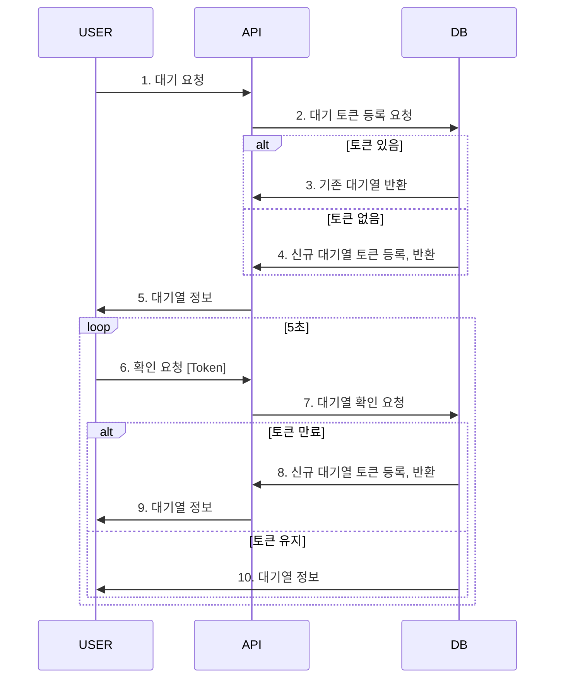

## 시나리오 선정 및 프로젝트 Milestone 제출

| 주차    | 목표                  | 상세 작업 내용                                                         |
| ------- | --------------------- | ---------------------------------------------------------------------- |
| 1주차   | 프로젝트 계획 및 설계 | 요구사항 분석, 시퀀스 다이어그램, 플로우 차트, 아키텍처 설계, ERD 작성 |
| 2주차   | 초기 개발 환경 구축   | 개발 환경 설정, 도구 설치                                              |
| 3주차   | 인증 및 사용자 관리   | JWT 인증, OAuth 구현, 사용자 관리 API                                  |
| 4~5주차 | 주요 기능 개발        | 핵심 API 및 비즈니스 로직 구현                                         |
| 6~7주차 | 테스트 및 최적화      | 테스트 작성, 성능 개선                                                 |
| 8주차   | 배포 준비 및 출시     | 서버 배포, 모니터링, CI/CD 구축                                        |

## 개발 환경

- Architecture
  - Layered Architecture Based + clean Architecture
  - Testable Business logics
- DB ORM
  - TypeORM
- Test
  - Jest

### 시퀀스 다이어그램

sequenceDiagram
participant USER
participant API
participant DB

sequenceDiagram
USER ->> API: 1. 대기 요청
API ->> DB: 2. 대기 토큰 등록 요청
alt 토큰 있음
DB ->> API: 3. 기존 대기열 반환
else 토큰 없음
DB ->> API: 4. 신규 대기열 토큰 등록, 반환
end
API ->> USER: 5. 대기열 정보
loop 5초
USER ->> API: 6. 확인 요청 [Token]
API ->> DB: 7. 대기열 확인 요청
alt 토큰 만료
DB ->> API: 8. 신규 대기열 토큰 등록, 반환
API ->> USER: 9. 대기열 정보
else 토큰 유지
DB ->> USER: 10. 대기열 정보
