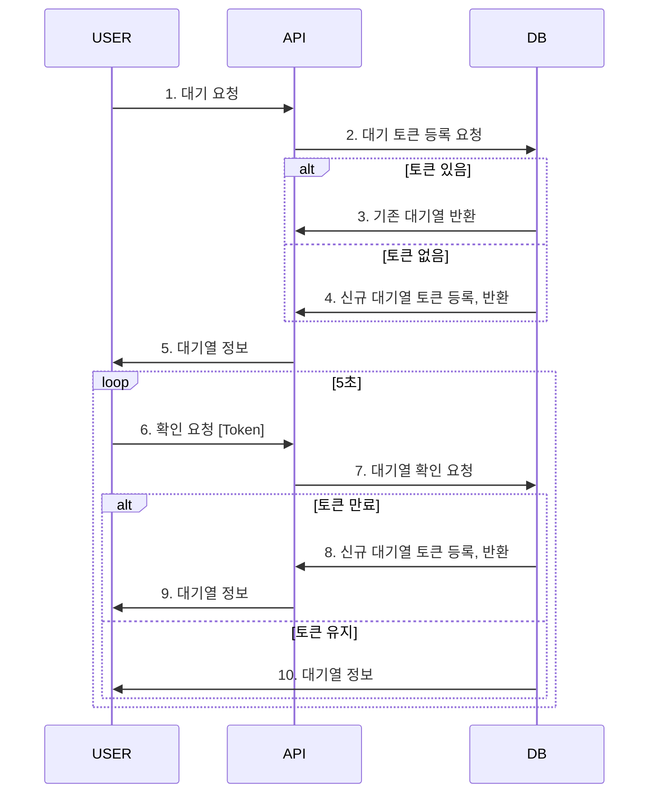
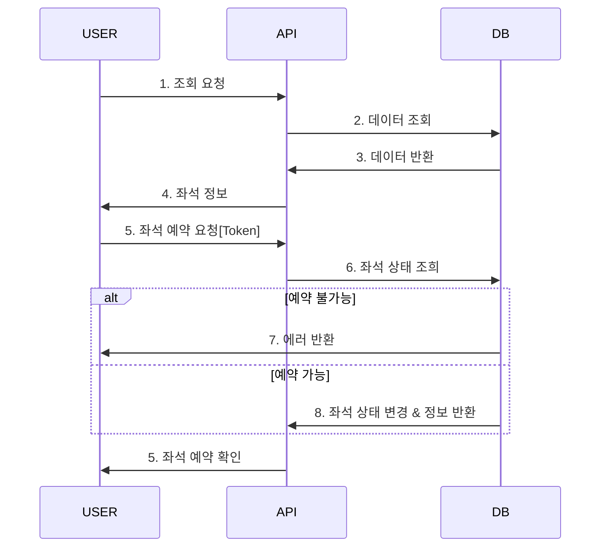
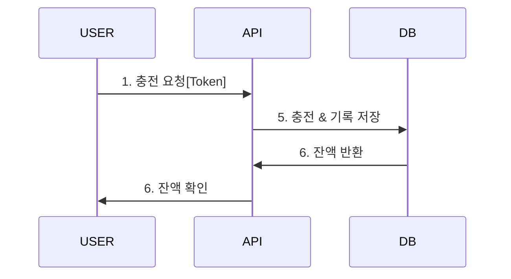
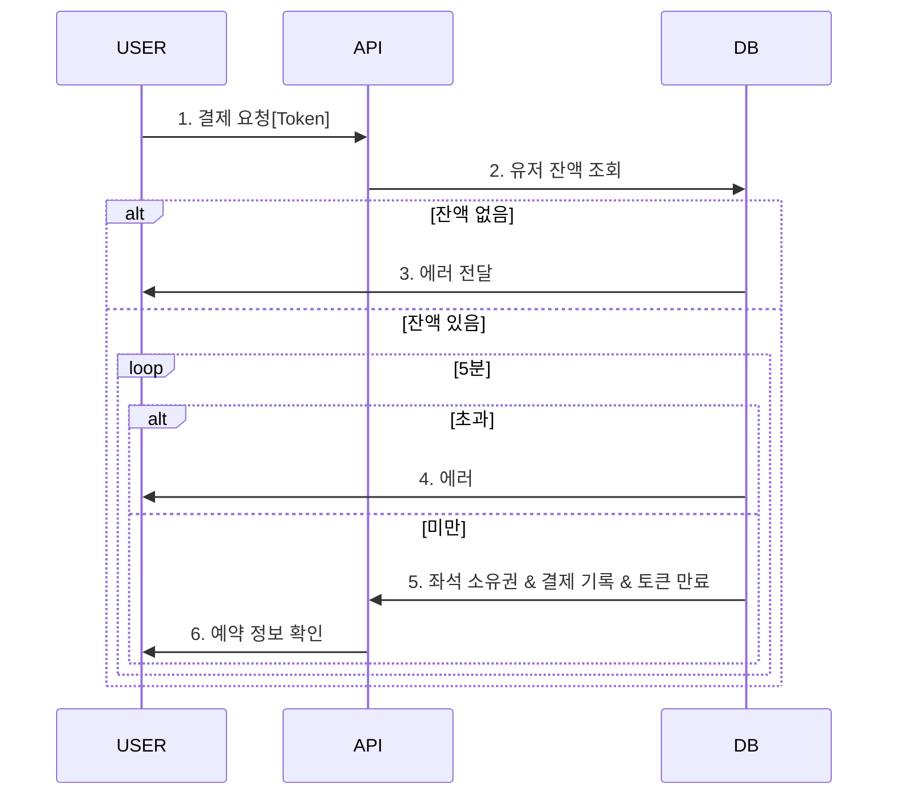

## 시퀀스 다이어그램

#### 유저 대기열 토큰 조회/요청 기능

```mermaid
sequenceDiagram
participant USER
participant API
participant DB
USER ->> API: 1. 대기 요청
API ->> DB: 2. 대기 토큰 등록 요청
alt 토큰 있음
DB ->> API: 3. 기존 대기열 반환
else 토큰 없음
DB ->> API: 4. 신규 대기열 토큰 등록, 반환
end
API ->> USER: 5. 대기열 정보
loop 5초
USER ->> API: 6. 확인 요청 [Token]
API ->> DB: 7. 대기열 확인 요청
alt 토큰 만료
DB ->> API: 8. 신규 대기열 토큰 등록, 반환
API ->> USER: 9. 대기열 정보
else 토큰 유지
DB ->> USER: 10. 대기열 정보
end
end
```

#### 예약 가능 날짜/좌석 조회 & 예약 요청

```mermaid
sequenceDiagram
  participant USER
  participant API
  participant DB
    USER ->> API: 1. 조회 요청
    API ->> DB: 2. 데이터 조회
    DB ->> API: 3. 데이터 반환
    API ->> USER: 4. 좌석 정보
    USER ->> API: 5. 좌석 예약 요청[Token]
    API ->> DB: 6. 좌석 상태 조희
alt 예약 불가능
    DB ->> USER: 7. 에러 반환
else 예약 가능
    DB ->> API: 8. 좌석 상태 변경 & 정보 반환
end
    API ->> USER: 5. 좌석 예약 확인
```

#### 잔액 충전

```mermaid
sequenceDiagram
  participant USER
  participant API
  participant DB
USER ->> API: 1. 충전 요청[Token]
API ->> DB: 5. 충전 & 기록 저장
DB ->> API: 6. 잔액 반환
API ->> USER: 6. 잔액 확인
```

#### 예약 결제

```mermaid
sequenceDiagram
  participant USER
  participant API
  participant DB
    USER ->> API: 1. 결제 요청[Token]
    API ->> DB: 2. 유저 잔액 조회
alt 잔액 없음
    DB ->> USER: 3. 에러 전달
else 잔액 있음
loop 5분
    alt 초과
        DB ->> USER: 4. 에러
    else 미만
        DB ->> API: 5. 좌석 소유권 & 결제 기록 & 토큰 만료
        API ->> USER: 6. 예약 정보 확인
end
end
end
```
