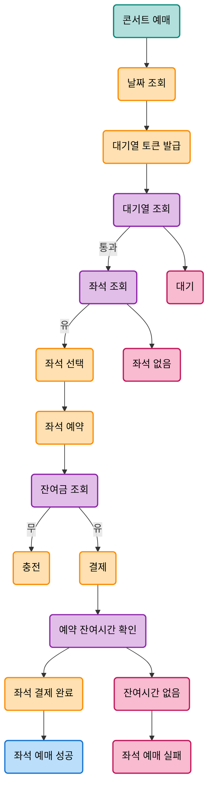

## 플로우 차트

```mermaid
flowchart TD
%% Nodes
A("콘서트 예매"):::green
B("날짜 조회"):::orange
C("대기열 토큰 발급"):::orange
CA("대기열 조회"):::purple
CAA("좌석 조회"):::purple
CAB("대기"):::pink
DA("좌석 선택"):::orange
DB("좌석 없음"):::pink
E("좌석 예약"):::orange
F("잔여금 조회"):::purple
FA("충전"):::orange
G("결제"):::orange
H("예약 잔여시간 확인"):::purple
HA("잔여시간 없음"):::pink
HAA("좌석 예매 실패"):::pink
HB("좌석 결제 완료"):::orange
HAB("좌석 예매 성공"):::blue
%% Edges
A --> B --> C
C  --> CA
CA -- 통과 --> CAA
CA --> CAB
CAA -- 유 --> DA --> E --> F -- 유 --> G --> H  --> HB --> HAB
CAA --> DB
F -- 무 --> FA
H --> HA --> HAA
%% Styling
classDef green fill:#B2DFDB,stroke:#00897B,stroke-width:2px,color:#000;
classDef orange fill:#FFE0B2,stroke:#FB8C00,stroke-width:2px,color:#000;
classDef blue fill:#BBDEFB,stroke:#1976D2,stroke-width:2px,color:#000;
classDef yellow fill:#FFF9C4,stroke:#FBC02D,stroke-width:2px,color:#000;
classDef pink fill:#F8BBD0,stroke:#C2185B,stroke-width:2px,color:#000;
classDef purple fill:#E1BEE7,stroke:#8E24AA,stroke-width:2px,color:#000;
```
